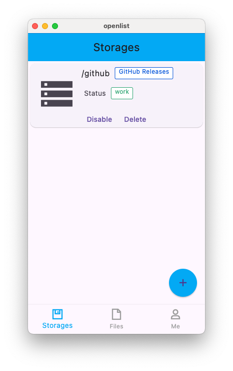
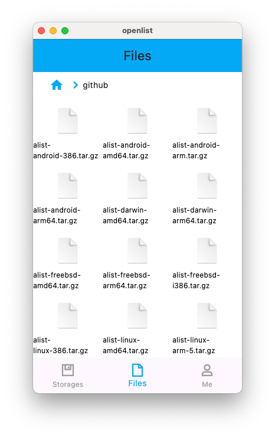
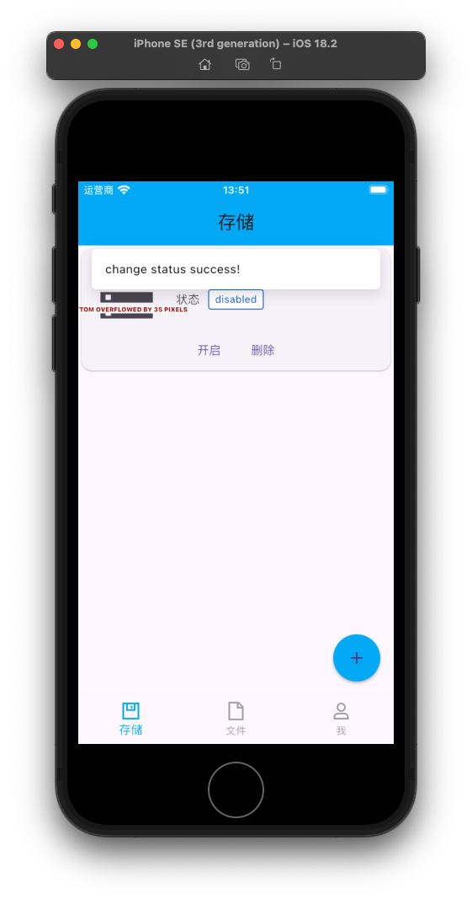
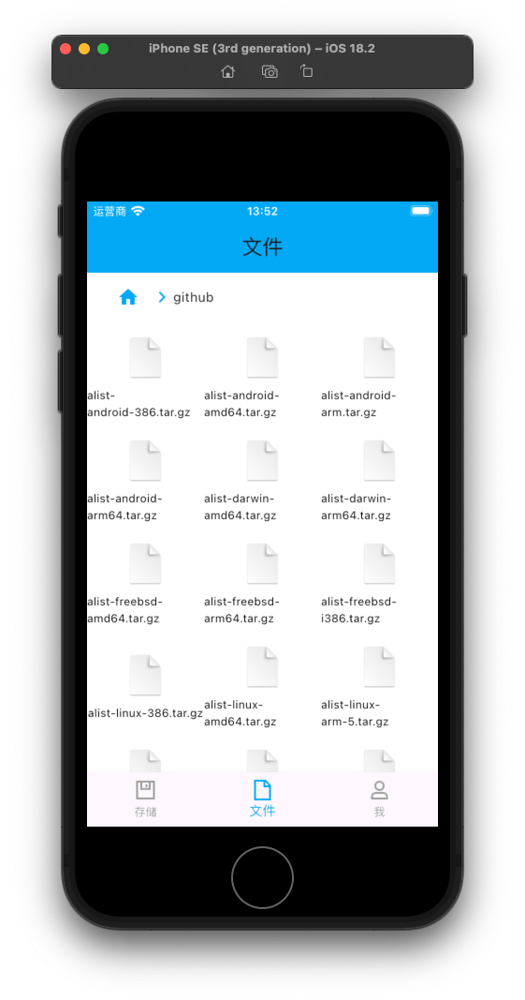

# OpenList App
### 一个AList、OpenList跨平台客户端，支持iOS、macOS、Windows、Android、Linux

 

 

### 未来通过CI构建、代码上传谷歌Dart pub.dev的方式留备份解决大家广泛关心的安全性问题，本项目不提供api服务器，服务器由上游OpenList等社区提供
### 项目提供两套UI，一套是原先的Web界面直接加载，另一套是目前已经开发完核心功能的原生界面
### 项目结构
 * [packages](packages)主要代码文件夹
 * [openlist](packages/openlist)APP入口项目
 * [openlist_api](packages/openlist_api)核心api封装
 * [openlist_background_service](packages/openlist_background_service)openlist(AList)库封装
 * [openlist_global](packages/openlist_global)全局共享代码
 * [openlist_native_ui](packages/openlist_native_ui) 原生界面代码
 * [openlist_web_ui](packages/openlist_web_ui)web界面代码
